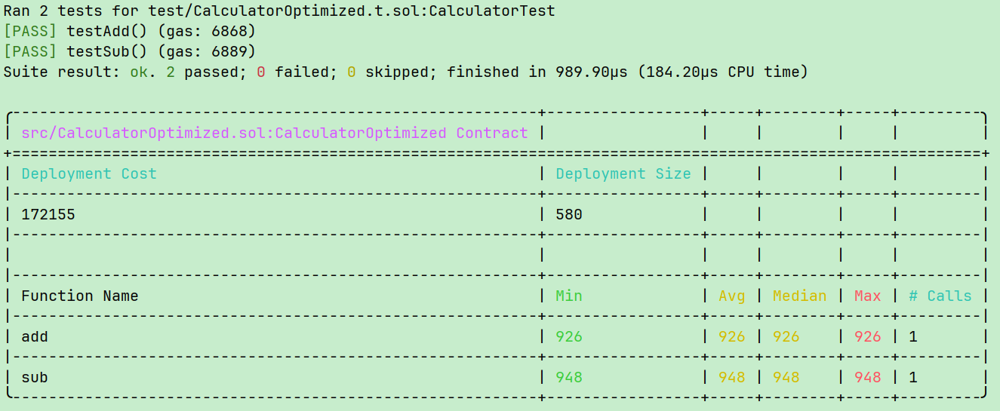

# Foundry实验报告

## 一、理论知识
Foundry 是一套面向以太坊智能合约开发的全流程工具链，主要包括以下组件：

- **Forge**：智能合约的构建、测试和部署工具。支持 Solidity 编译、单元测试、Gas 测试等功能。
- **Cast**：命令行交互工具，可直接发送交易、调用合约方法以及查询链上数据。
- **Anvil**：本地测试链，用于快速部署和调试智能合约，类似于 Ganache。

Foundry 的核心优势在于快速迭代和高效的测试能力，能够在本地模拟区块链环境、执行复杂交易和分析 Gas 消耗。

## 二、实践操作

### 1. 搭建测试环境
进入 `contract-practice\task3` 目录，初始化 Forge 项目：

```bash
forge init .
```

### 2. 编写智能合约
创建 `Calculator.sol`，内容如下：

```solidity
// SPDX-License-Identifier: MIT
pragma solidity ^0.8;

contract Calculator{
    uint256 public lastResult;
    // 加法
    function add(uint256 a, uint256 b) public returns (uint256) {
        uint256 result = a + b;
        lastResult = result;
        return result;
    }
    // 减法
    function sub(uint256 a, uint256 b) public returns (uint256) {
        uint256 result = a - b;
        lastResult = result;
        return result;
    }
}
```

### 3. 编写单元测试
创建 `Calculator.t.sol`，内容如下：
```solidity
// SPDX-License-Identifier: UNLICENSED
pragma solidity ^0.8;

import "forge-std/Test.sol";
import "../src/Calculator.sol";

contract CalculatorTest is Test {
    Calculator calculator;
    function setUp() public {
        calculator = new Calculator();
    }
    function testAdd() public {
        assertEq(calculator.add(5, 3), 8);
    }
    function testSub() public {
        assertEq(calculator.sub(10, 6), 4);
    }
}
```

### 4. 执行测试并记录 Gas 消耗
```bash
forge test --gas-report
```
记录原始 Gas 消耗如下（示例）：


### 5. Gas 优化策略
1. **优化函数为 `pure`**（已经使用 `pure` 修饰）。
2. **简化返回逻辑**：直接返回表达式而非使用中间变量。

优化后的智能合约：

```solidity
// SPDX-License-Identifier: MIT
pragma solidity ^0.8;

contract CalculatorOptimized{
    // 加法
    function add(uint256 a, uint256 b) external pure returns (uint256) {
        return a + b;
    }
    // 减法
    function sub(uint256 a, uint256 b) external pure returns (uint256) {
        return a - b;
    }
}
```

再次执行 Gas 测试：


### 6. Gas 优化分析
在本例中，由于原始函数逻辑非常简单，优化效果主要体现在代码可读性与维护性上，Gas 消耗基本持平。对于更复杂的函数，减少状态读写、优化循环和条件判断可以显著降低 Gas 消耗。

## 三、总结
1. Foundry 提供了一套完整的智能合约开发、测试和部署工具链，能够快速构建和验证智能合约功能。
2. 使用 Forge 可以方便地进行单元测试和 Gas 消耗分析。
3. 合约优化应根据具体逻辑设计，简单函数优化空间有限，复杂逻辑优化潜力更大。
---


